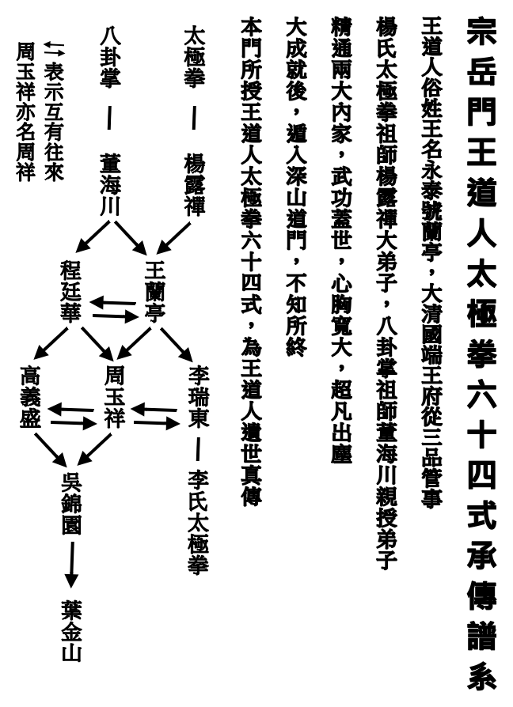
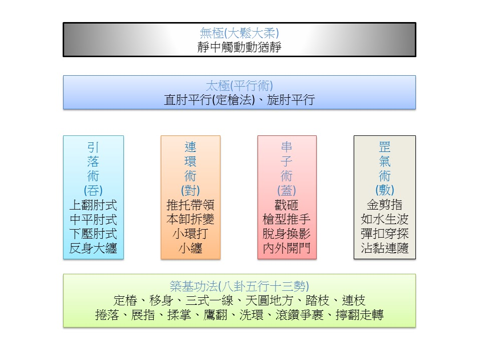

序
=======

本書收錄宗岳門太極拳宗長葉金山老師的技術文章，加以分門別類，旨在促進門內的人理解本門太極拳的整體架構。

宗岳門太極拳傳承譜系

本書除前人文章章節內的文章為前人所作之外，其餘文章皆在首段標名作，或為宗長葉金山，或為各館館長或教練，故版權分屬各作者所有，本人僅編排書目，不具有本書版權。歡迎散布本書，但請勿任意刪改，謝謝。

本書選文採全文引用，於重要之處會特別強調，期望協助讀者提綱挈領之餘，不致錯失其他環節。

宗岳門太極拳架構（正氣道館）

太極拳是一門博大精深的技術，與任何技術一樣，如果讓初學者一下就跳進其中一項基本技術的細節，則學習緩慢，見樹不見林，成就少亦無樂趣，但若從最高階心法入門，則初學者又會難以理解，同時也會失去興趣。是故本圖旨在以最簡約的方式呈現宗岳門太極拳的整體架構和階層。

本書第一章收錄前人文章，後三章則依上圖順序，第二章將同時涵蓋無極和太極，第三章為核心四術，第四章則為築基功法。

葉學舫　編