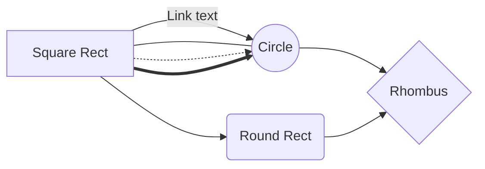
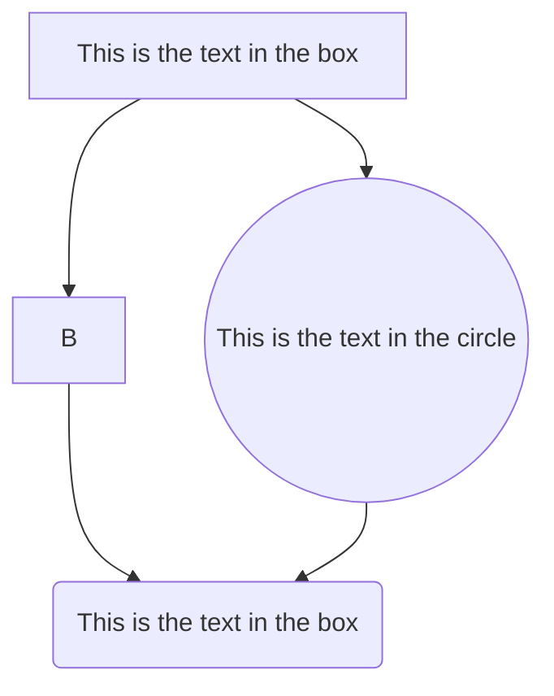
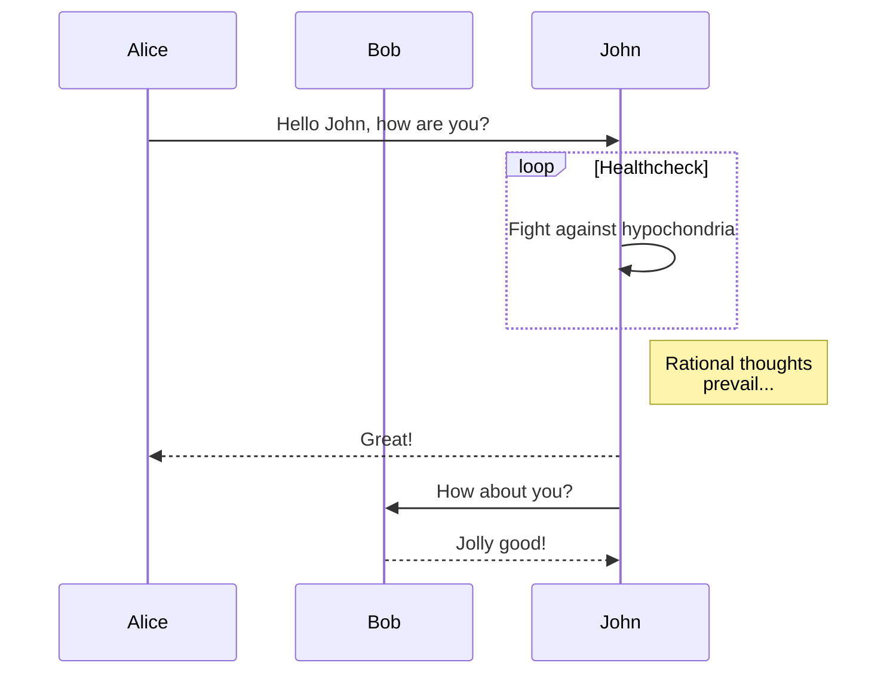

# 築基功法

* 基本功法
* 五弓大展
* 

```sequence
Title: Here is a title
A->B: Normal line
B-->C: Dashed line
C->>D: Open arrow
D-->>A: Dashed open arrow
```

```sequence-hand
Title: Here is a title
A->B: Normal line
B-->C: Dashed line
C->>D: Open arrow
D-->>A: Dashed open arrow
```










