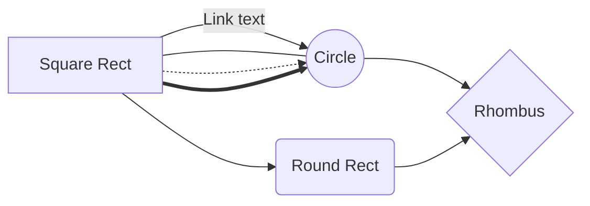
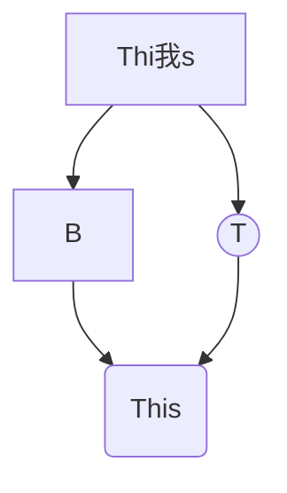
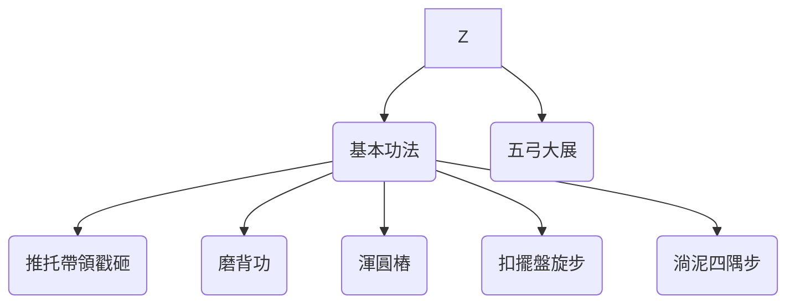

# 築基功法

```mermaid
graph LR
    A[Square Rect] -- Link text --> B((Circle))
    A --> C(Round Rect)
    B --> D{Rhombus}
    C --> D
    A --- B
    A -.-> B
    A ==> B
```

```mermaid
graph TD;
    A[Thi我s]-->B;
    A-->C((T));
    B-->D;
    C-->D(This);
```

```mermaid
graph TD;
    Z-->A(基本功法);
    A-->B(推托帶領戳砸);
    A-->C(磨背功);
    A-->D(渾圓樁);
    A-->E(扣擺盤旋步);
    A-->F(淌泥四隅步);
    Z-->G(五弓大展);
```
