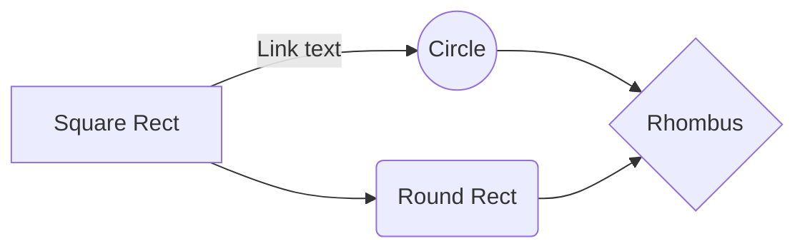
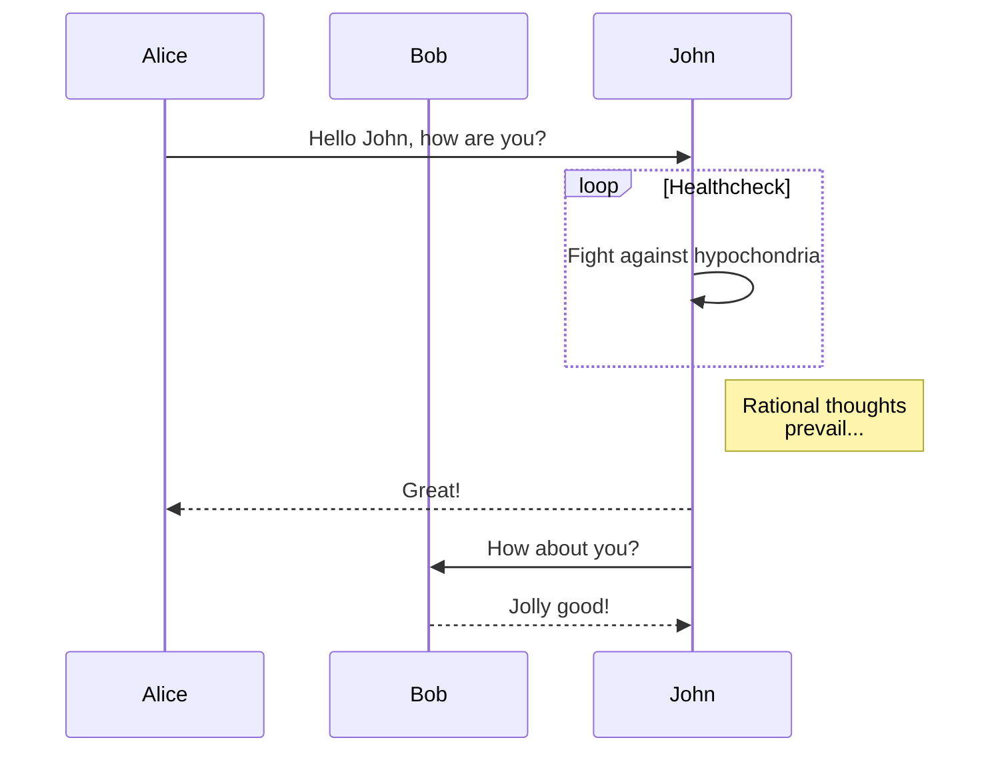
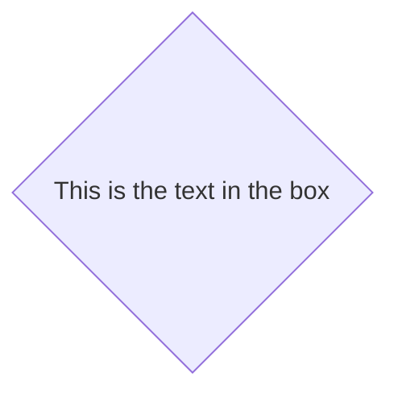
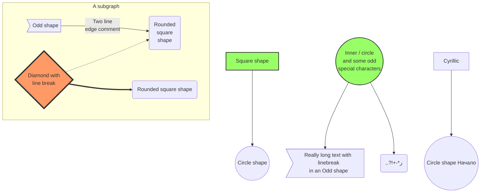

# 築基功法

* 基本功法
* 五弓大展
* 

```sequence
Title: Here is a title
A->B: Normal line
B-->C: Dashed line
C->>D: Open arrow
D-->>A: Dashed open arrow
```

```sequence-hand
Title: Here is a title
A->B: Normal line
B-->C: Dashed line
C->>D: Open arrow
D-->>A: Dashed open arrow
```










```mermaid
graph LR
A-->B
A --- B
A-- This is the text --- B
A---|This is the text|B;
-.->
==>
```




| 0:0 | 1:0 | 2:0 | 3:0 | -- |
| -- | -- | -- | -- | -- |
| 0:2 | 1:2 | 2:2 | 3:2 | 4:2 |
| 0:3 | 1:3 | 2:3 | 3:3 | 4:3 |
| 0:4 | 1:4 | 2:4 | 3:4 | 4:4 |
| 0:5 | 1:5 | 2:5 | 3:5 | 4:5 |
