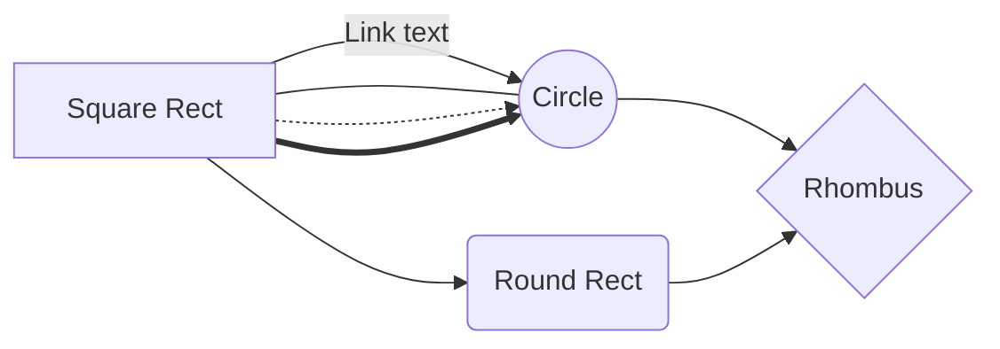
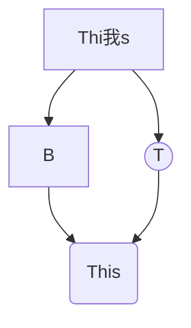
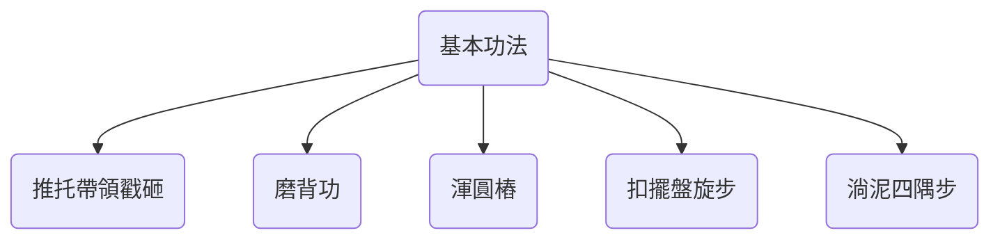
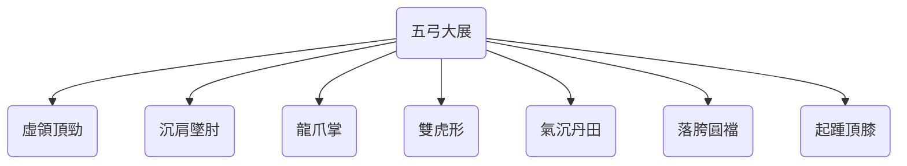

# 築基功法

```mermaid
graph LR
    A[Square Rect] -- Link text --> B((Circle))
    A --> C(Round Rect)
    B --> D{Rhombus}
    C --> D
    A --- B
    A -.-> B
    A ==> B
```

```mermaid
graph TD;
    A[Thi我s]-->B;
    A-->C((T));
    B-->D;
    C-->D(This);
```

```mermaid
graph TD;
    A(基本功法)-->B(推托帶領戳砸);
    A-->C(磨背功);
    A-->D(渾圓樁);
    A-->E(扣擺盤旋步);
    A-->F(淌泥四隅步);

```

```mermaid
graph TD;
    A(五弓大展)-->B(虛領頂勁);
    A-->C(沉肩墜肘);
    A-->D(龍爪掌);
    A-->E(雙虎形);
    A-->F(氣沉丹田);
    A-->G(落胯圓襠);
    A-->H(起踵頂膝);
```
    