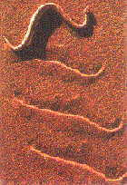

# 談太極拳為什麼用掌

宗長
葉金山

據說很多看慣拳擊的外國人，初次見到中國武術時，覺得很奇怪，為什麼中國武術用掌的份量那麼多，甚至還有像太極拳，八卦掌那樣幾乎大部份用掌法練習的拳術，他們心裡會問，拳不是比掌硬嗎？幹嘛不用拳打人，而要用掌打人呢？

這樣的問題，不但外國人提出，連中國人本身練掌，練得莫名其妙的也不在少數。由於長期以來中國武術，掌法的運用解釋含糊不明，尤其是太極拳的掌法，在過去所謂名家示範及競技時，大多只用於推手的推人，這是掌的偏長用法，也是掌法的窄化，這種含糊、偏長而窄化的用掌方法，使得人們幾乎已經忘記中國武術用掌的原因。

中國武術，尤其是內家武術為什麼用掌？簡單地說，因為中國武術，尤其是內家武術，早已脫離拳打腳踢的簡單格鬥模式，而發展成「摔打拿踢」一體的綜合格鬥模式，這個格鬥模式，在於以更全面的綜合技術，來對抗徒手與兵器。

由於綜合格鬥的需要，中國武術由外而內，逐漸演變出以掌為主導的武術風格；在現代的世界綜格鬥競技中，我們也可以看到，綜合格鬥武者們很少會以握拳方式作為格鬥主導，綜合格鬥者也因為摔拿的需要，而拋棄了拳套，以便於用掌拿摔。這個例子，也間接證明了中國用掌武術如太極拳，即是完完整整的綜合格鬥武術。

掌法最重要的是，能夠很方便地綜合「摔打拿踢」成為混合格鬥技術，如果純用握拳，想要加入「摔拿」的技術，就沒有掌法這麼便利了。所以像摔角、柔道、合氣道、以及其他善於摔拿的柔術，大多不以握拳方式進行戰鬥，而是以開指的掌法為基本型態。

像太極拳掌法之所以主導整個拳法，就是因為太極拳是「摔打拿踢」一體的綜合武術，過去很多人並不了解太極拳的綜合武術特質，長期在拳架上盲目要求「踢打」的勁道，並以「踢打」的勁道作為太極拳強弱的判準，因而全面否定了太極拳摔角、擒拿、制鎖的技巧。甚至有人以太極拳在拳擊、空手道、跆拳道、泰拳........等「踢打」規則，而非「摔打拿踢」綜合格鬥規則下不能勝出，來全面否定太極拳的價值。

這是太極拳被這些非綜合格鬥武術，以規則扭曲太極拳技術的結果，如果太極拳家不能夠從非綜合格鬥的夢境中醒來，硬要將太極拳推向「踢打」武術的硬拳模式，而非柔術模式，如此想要弘揚太極拳無異是緣木求魚。

很多人不懂內家武術，尤其是太極拳八卦掌怎麼用於格鬥搏擊，事實上絕大部份的原因，就是對掌法的技術和用法不了解所致。

所以改變掌法的戰鬥思維，才能真確認識用掌武術。譬如家師吳錦園先生所授太極拳技術，右手持人頸後衣領向下托，左手順勁壓制前頸摔倒對手的摔跌技術，即等同於一般太極拳的「掤、擠」手法，可是一般人用「掤、擠」手法，多是右手掌背貼敵胸前，左手往右手掌心發勁將人推出；家師所授是摔，時人所用是推，因此宗岳門公開此種太極拳摔技時，時人竟不知這是太極拳手法，而污衊為合氣道。

譬如家師所授八卦後天掌「虎」式。此法卸化敵勁後，進入對方背後可打後腦，亦可用雙手由前往後輕敷敵頸，再向後摔倒對手。但知打而不知摔者，竟又以污衊此手法是合氣道，卻不知家師傳授此等手法時，我年齡尚不到二十歲，當時台灣對合氣道知者不多，我更是連合氣道是什麼，也沒從聽過見過。

「摔打拿」加上「踢」，這就是中國內家武術的正統打法，更是太極拳的傳統綜合格鬥技法，不能因為少數門派名師不懂運用，即加以否定，因為否定「摔打拿踢」一體之技，事實上就等於是全面否定太極拳。

可以抱人，可以用頭拳肘打擊，可以摔，可以擒拿壓制鎖死，可以用足膝踢擊，甚至可以用頭錘，這樣綜合性的武術競技，就是最真實的太極拳綜合戰技，而這樣的太極拳綜合格鬥模式，如果純粹用握拳來練習，是無法有效達成的，一定要懂得用掌法才行。

有些外家拳及外國武術的掌法只用來砍人頸部，或只在以小臂進行格擋時，以掌代拳。這樣的用掌方式，比起內家太極拳，算是極為粗略的。

內家的掌法，非常細緻，從指的左右擺扣開展等小動作，到推托帶領所發展的纏法等大動作，全都是以掌法進行，而宗岳門所授的「揉掌」技術，更重視純陰掌、純陽掌及轉陰陽的訓練。整個掌法在環內行動時，如果刻意以「揉掌」方式行進，行跡就和蛇在沙漠中直線行走時完全一樣，因為蛇行走留在沙中的痕跡，不是一條直線，而是一整排的斜平行線；而「揉掌」行進時，其軌道是圓，而其行跡是斜平行線，我們稱之為軌跡。(請參考圖一)

<small>(圖一)蛇在沙漠中直線行進，在沙上所留下的痕跡為斜平行線，與宗岳門太極拳揉掌所形成的痕跡完全相同。(本圖片如有侵權請告知，將立即移除)</small>

宗岳門像蛇這樣行進的掌法才叫「揉掌」，其他門派所用的掌法都不是真正「揉掌」。「揉掌」原本就是屬於蛇形的纏法，所以內家武術的掌法變化就和蛇一樣，詭譎多變而靈活。內家武術常說「行如蛇，動如羽」，「行如蛇，動如羽」並不是一種抽象的描繪，而是其掌法真實的寫照。

蛇以揉動的方式前進，可以導引出全身的力量，讓行動更省力。太極拳掌法像蛇一樣，以揉式進行，揉式進行之所以勝過非揉式進行的掌法，就是因為這樣像蛇一樣的行進掌法，能夠導出全身的內勁用在掌上，而非揉式的掌法，則無法導出這樣的力量。

以「揉掌」進行的掌法，在吞化收拳，手掌接近腰部時，手肘不會拉到腰後及背後，而會指向東北方向，所以「揉掌」和非揉掌法，極易辨認。

很多人練掌，所練出的掌法都沒有揉的力量，在教學上我們戲稱之為「再見掌、拜拜掌」，因為這種掌法的動作和一般人分手說再見的動作幾乎沒有兩樣。這種不含揉法的「再見掌、拜拜掌」練三五十年也不長功，這也是為什麼很多人練掌練了一輩子練不出掌勁的原因。

古人拳論中，常談到掌法如龍如蛇(蛇的尊稱就是小龍)，這是因為他們知道龍蛇行動的形態，並將之用於掌法上，一個沒有對掌法深入了解的人，其眼力是分不出「揉掌」和「再見掌、拜拜掌」有什麼不同的。

掌法除了要能夠以揉法導出內勁，還要能夠隨時轉換成握拳，也就是說要能夠「化掌為拳」。

如果只是一般只用來砍人頸部，或只在以小臂進行格擋時，以掌代拳的掌法，要立刻變拳當然很容易。但是如果要像內家拳那樣，在「摔拿」這麼複雜的綜合動作進行中，忽然變掌為打，如果技術不良，常常不是慢半拍，就是生出無效的亂拳，甚至因為動作錯誤用力過猛而自傷筋骨。

所以平常要對太極拳吞吐的纏法軌跡，進行充份的練習，如此不但「化掌為拳」的技術會變得很簡單，甚至進行肘擊，也會變得如魚得水。

掌法技術是內家武術的精華部份，沒有完美的掌法，就不能夠談到從有形進入無形。掌法之有形者掌法之標準形也，掌法之無形者掌法之至鬆至柔至圓至簡，而入於神明者也。

凡是善於用掌者，其所施之技，絕非單獨偏長之技，而是「摔打拿踢」混合運用之綜合技，一般人以拳擊加上腿法的單純戰鬥觀念，是不會明白綜合格鬥技中，為什麼很多時候是要五指打開，而不是握拳的。

因為越是用掌用柔的武術，就是越看重「摔拿」的武術，而太極拳「摔打拿踢」綜合技術，更是「掌法為基，化掌成拳」的技術，太極拳的精於用掌用柔，並精於化掌成拳，就是看重合擊的「摔拿」，以及分擊的「打踢」的原故，所以宗岳門常說以掌為主導的太極拳，是分合並用的綜合武術，就是這個原因。